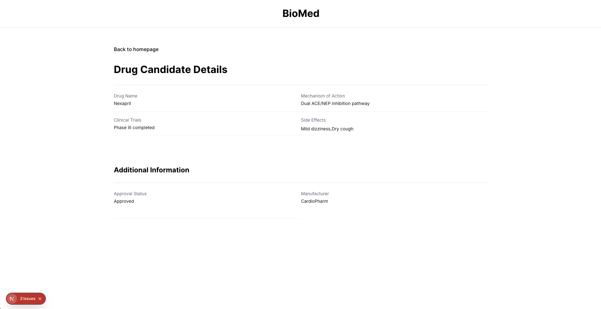

# BioMed

A proof of concept for managing and viewing drug candidates.


&nbsp;



This is a proof of concept for a drug candidate management system. The application provides an intuitive interface for viewing and searching drug candidates, with detailed information about each drug's status, clinical trials, mechanism of action, and side effects.

&nbsp;

## Features

- ✔️ List Drug Candidates
- ✔️ Search by Drug Name
- ✔️ View Detailed Drug Information
- ✔️ Pagination Support for Large Data Sets
- ✔️ Drug Status Indicators (Approved/Pending)
- ✔️ Responsive Design
- ✔️ Loading States
- ✔️ Bookmarkable Drug Details Pages
- ✔️ Automatic Form Validation
- ✔️ A11Y Compliant
- ✔️ Error handling and Recovery

&nbsp;

## Design

View the application design mockup on [Figma](https://www.figma.com/design/kYmkptgEw4Eykm3GuBlhdo/BioMed?node-id=0-1)

## Built With

- TypeScript, React, Next.js
- TailwindCSS
- Playwright for E2E Testing
- Jest, React Testing Library
- JSON Server for API Mocking
- Figma for UI Design

## Getting Started

To get a local copy up and running follow these simple example steps.

### Prerequisites

To run this project, you will need to have `node`,`npm` or `yarn`, `TypeScript` already installed locally

### Setup

`Clone the project and cd into the directory`

### Install

run `npm install` or `yarn` to install all the dependencies of the project.

### Add env file

create a `.env` file in the project root directory and add the following env vars:

- API_BASE_URL : This is a url which `json-server` will run on example: `http://localhost:4000`

### Usage

run `npm dev` or `yarn dev` to get the project running

open browser and navigate to `http://localhost:3000/`

&nbsp;

### Customizations

The styles are written using TailwindCSS.

To tweak components navigate to following directories:

- `/components` - Reusable UI components
- `/routes` - Page components and routing logic
- `/utils` - Utility functions and types
- `/hooks` - Custom React hooks

To access global styles navigate to `./routes/root-layout.css`

&nbsp;

## Tests

Both E2E and Unit tests are implemented.

### Running Tests

#### All Tests

```bash
npm run test
```

#### E2E Tests

```bash
npm run test:e2e
```

#### Unit Tests

```bash
npm run test:unit
```

- `typecheck` – checks TypeScript types
- `lint` – runs ESLint
- `format:check` – checks files with Prettier
- `test:watch` – starts jest watch

### Other scripts

- `format` – formats all files with Prettier

#### Analysis report

&nbsp;

## Deployment

run `npm build` or `yarn build` to generate build folder. You can now serve the build folder on any server. for more information visit [Next.js](https://nextjs.org/docs/pages/building-your-application/deploying).

&nbsp;

## Authors

👤 **Author**

- Github: [solomonakp](https://github.com/solomonakp)
- twitter: [@dev_chuck](https://twitter.com/dev_chuck)

&nbsp;

## 📝 License

This project is [MIT](lic.url) licensed.
